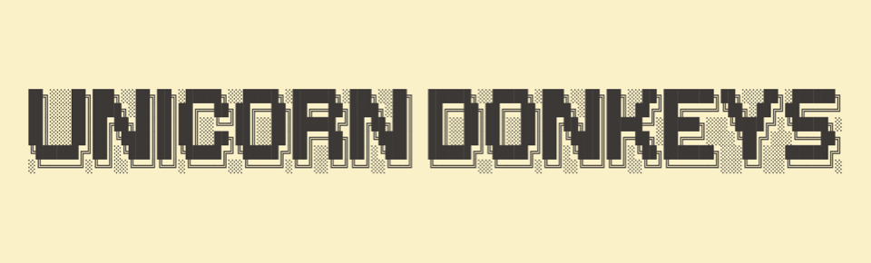

<p align="center">

    
</p>

<p align="center">
    
    
    
    <a href="https://x.com/GOrpello">
        
    </a>
</p>

LazySwipeActions is a modifier that allows you to implement custom swipe actions even if you're not working with a `List`. It is designed to be as close as possible to the [original modifier](https://developer.apple.com/documentation/swiftui/view/swipeactions(edge:allowsfullswipe:content:)) `.swipeActions(content: <#T##() -> View#>)` from the SwiftUI library.

- [See it in action](#see-it-in-action)
- [How to use LazySwipeActions in your project](#how-to-use-LazySwipeActions-in-your-project)
- [License](#license)

## See it in action

This repository includes a cross-platform sample project that demonstrates this package in action. The sample project is built using SwiftUI.

[Example Repository](https://github.com/gorpello/LazySwipeActions_Example)

or just visit this url:

`https://github.com/gorpello/LazySwipeActions_Example`

The sample project contains example on how to use this package code.

## How to use LazySwipeActions in your project

You can import LazySwipeActions into your project using the Swift Package Manager. In Xcode, click _File_ → _Swift Packages_ → _Add Package Dependency..._ → choose target to add LazySwipeActions to → enter https://github.com/gorpello/LazySwipeActions, press Next → set the version preference, and confirm.

Alternatively, if you're using `Package.swift`, simply add this dependency:

    dependencies: [
        .package(url: "https://github.com/gorpello/LazySwipeActions", branch: "main")
    ]

After that, to use `LazySwipeActions` in your Swift file, you'll first need to import it:

```swift
import LazySwipeActions
```

After that, you can easily apply the modifier.

```swift
Text("Some View")
	.lazySwipeActions {
		SwipeAction(tint: .green,
					  icon: "popcorn") {
           print("Do some Action")
       }
    }
```

## License

MIT License.

Copyright (c) 2024 Gianluca Orpello and other authors.

Permission is hereby granted, free of charge, to any person obtaining a copy of this software and associated documentation files (the "Software"), to deal in the Software without restriction, including without limitation the rights to use, copy, modify, merge, publish, distribute, sublicense, and/or sell copies of the Software, and to permit persons to whom the Software is furnished to do so, subject to the following conditions:

The above copyright notice and this permission notice shall be included in all copies or substantial portions of the Software.

THE SOFTWARE IS PROVIDED "AS IS", WITHOUT WARRANTY OF ANY KIND, EXPRESS OR IMPLIED, INCLUDING BUT NOT LIMITED TO THE WARRANTIES OF MERCHANTABILITY, FITNESS FOR A PARTICULAR PURPOSE AND NONINFRINGEMENT. IN NO EVENT SHALL THE AUTHORS OR COPYRIGHT HOLDERS BE LIABLE FOR ANY CLAIM, DAMAGES OR OTHER LIABILITY, WHETHER IN AN ACTION OF CONTRACT, TORT OR OTHERWISE, ARISING FROM, OUT OF OR IN CONNECTION WITH THE SOFTWARE OR THE USE OR OTHER DEALINGS IN THE SOFTWARE.

LazySwipeActions was made by [Gianluca Orpello](https://gianlucaorpello.com). It’s available under the MIT license, which permits commercial use, modification, distribution, and private use.

<p align="center">
    <a href="https://unicorndonkeys.com">
    </a>
</p>

<p align="center">
    <b>A Unicorn Donkeys project</b>
</p>
